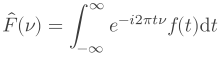

<p align="center">
    
    <h1 style="text-align: center;">ZigTeX</h1>
</p>

ZigTeX is a wrapper around [MicroTeX](https://github.com/NanoMichael/MicroTeX/tree/openmath) with a custom SVG renderer. ZigTeX principally gives you one function, which takes some LaTeX code and spits out an SVG:

```zig
const std = @import("std");
const ztex = @import("zigtex");

pub fn main() !void {
    var gpa = std.heap.GeneralPurposeAllocator(.{}){};
    defer _ = gpa.deinit();
    const allocator = gpa.allocator();

    var render = try ztex.TexSvgRender.init(allocator, .{});
    defer render.deinit();

    const tex =
        \\\begin{equation}
        \\    \hat{F}(\nu) = \int_{-\infty}^\infty e^{-i 2\pi t \nu} f(t) \text{d}t
        \\\end{equation}
    ;

    const output = try render.parseRender(allocator, tex, .{});
    defer allocator.free(output);

    var f = try std.fs.cwd().createFile("example.svg", .{});
    defer f.close();
    try f.writeAll(output);
}
```
This produces the title image on a transparent background.

## Usage

To use in your Zig project, add this project as a dependency
```bash
zig fetch --save https://github.com/fjebaker/zigtex/archive/main.tar.gz
```

Then modify your `build.zig` in the usual way:
```zig
const zigtex_dep = b.dependency(
    "zigtex",
    .{.optimize = optimize, .target = target},
);

// ...
exe.root_module.addImport("zigtex", zigtex_dep.module("zigtex"));
```
